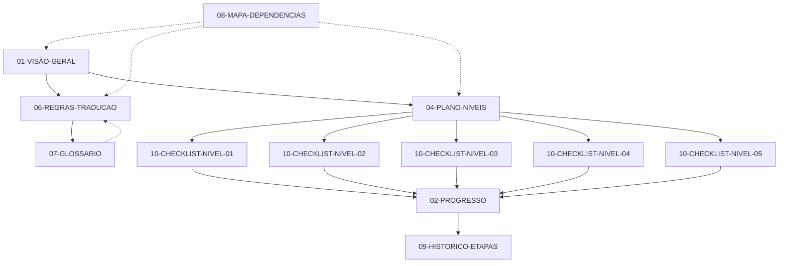

# 🗺️ Mapa de Dependências e Ordem de Leitura

Este documento descreve a ordem lógica de leitura dos arquivos de documentação e as dependências entre eles.

## 📋 Ordem Recomendada de Leitura

### Para Novos Colaboradores

```
1. 01-VISÃO-GERAL.md          ← Comece aqui!
2. 06-REGRAS-TRADUCAO.md       ← Entenda como traduzir
3. 07-GLOSSARIO.md             ← Consulte termos técnicos
4. 04-PLANO-NIVEIS.md          ← Compreenda as prioridades
5. 08-MAPA-DEPENDENCIAS.md     ← Este arquivo
6. 02-PROGRESSO.md             ← Veja o status atual
7. 10-CHECKLIST-NIVEL-01.md    ← Escolha um arquivo para traduzir
```

### Para Tradutores Ativos

```
1. 06-REGRAS-TRADUCAO.md       ← Revise as regras
2. 07-GLOSSARIO.md             ✓ Mantenha aberto durante tradução
3. 10-CHECKLIST-NIVEL-XX.md    ← Seu nível de trabalho atual
4. 02-PROGRESSO.md             ← Atualize após concluir
```

## 🔗 Dependências Entre Documentos



## 📊 Matriz de Dependências

| Documento | Pré-requisitos | Utilizado Por |
|-----------|----------------|---------------|
| 01-VISÃO-GERAL.md | Nenhum | Todos os outros |
| 02-PROGRESSO.md | 03-CHECKLIST-GERAL | 09-HISTORICO-ETAPAS |
| 03-CHECKLIST-GERAL.md | Nenhum | 02-PROGRESSO, Checklists por nível |
| 04-PLANO-NIVEIS.md | 01-VISÃO-GERAL | Checklists por nível |
| 05-ETAPA-03.md | 01-VISÃO-GERAL | 09-HISTORICO-ETAPAS |
| 06-REGRAS-TRADUCAO.md | 01-VISÃO-GERAL | Todos os tradutores |
| 07-GLOSSARIO.md | 06-REGRAS-TRADUCAO | 06-REGRAS-TRADUCAO, Tradutores |
| 08-MAPA-DEPENDENCIAS.md | Nenhum | Todos (referência) |
| 09-HISTORICO-ETAPAS.md | 02-PROGRESSO, 05-ETAPA-03 | Ninguém |
| 10-CHECKLIST-NIVEL-01.md | 04-PLANO-NIVEIS | Tradutores |
| 10-CHECKLIST-NIVEL-02.md | 04-PLANO-NIVEIS | Tradutores |
| 10-CHECKLIST-NIVEL-03.md | 04-PLANO-NIVEIS | Tradutores |
| 10-CHECKLIST-NIVEL-04.md | 04-PLANO-NIVEIS | Tradutores |
| 10-CHECKLIST-NIVEL-05.md | 04-PLANO-NIVEIS | Tradutores |

## 🎯 Fluxo de Trabalho Sugerido

### Fase 1: Onboarding (Novos Colaboradores)

```
Dia 1:
├── Ler 01-VISÃO-GERAL.md (30 min)
├── Ler 06-REGRAS-TRADUCAO.md (45 min)
└── Explorar 07-GLOSSARIO.md (30 min)

Dia 2:
├── Ler 04-PLANO-NIVEIS.md (20 min)
├── Revisar 02-PROGRESSO.md (10 min)
└── Escolher primeiro arquivo do Nível 01
```

### Fase 2: Tradução Ativa

```
Para cada arquivo a traduzir:
├── Abrir 07-GLOSSARIO.md (sempre à mão)
├── Consultar 06-REGRAS-TRADUCAO.md (quando tiver dúvidas)
├── Acessar checklist do nível correspondente
├── Traduzir arquivo seguindo padrão
├── Revisar tradução
└── Atualizar 02-PROGRESSO.md
```

### Fase 3: Revisão e Consolidação

```
Periodicamente:
├── Verificar consistência no glossário
├── Atualizar 09-HISTORICO-ETAPAS.md
├── Revisar 02-PROGRESSO.md
└── Planejar próxima etapa
```

## 📁 Dependências entre Arquivos do OpenTTD

### Núcleo Crítico (Nível 01) - Leia Primeiro

Estes arquivos são fundamentais e devem ser traduzidos antes dos demais:

```
vehicle_type.h ──┬──> vehicle_base.h ──> aircraft.h
                 │
engine_type.h ───┤
                 │
station_type.h ──┘
```

**Ordem sugerida:**
1. `vehicle_type.h` - Define tipos básicos de veículos
2. `engine_type.h` - Define tipos de motores
3. `station_type.h` - Define tipos de estações
4. `vehicle_base.h` - Base para todos os veículos (depende dos anteriores)
5. `aircraft.h` - Implementação específica de aeronaves

### Sistemas Principais (Nível 02)

```
Dependências comuns:
├── vehicle_*.h (do Nível 01)
├── cargo_type.h
└── company_type.h
```

### Interfaces (Nível 03)

```
Depende de:
├── Sistemas principais (Nível 02)
├── Tipos básicos (Nível 01)
└── Bibliotecas GUI
```

## 🔄 Atualizações e Versionamento

Quando um arquivo é atualizado:

1. **Verifique dependências**: Quais outros documentos podem precisar de atualização?
2. **Atualize o histórico**: Registre em 09-HISTORICO-ETAPAS.md
3. **Notifique colaboradores**: Se mudanças afetarem trabalho em andamento

## 📞 Dicas de Navegação

### Links Rápidos

- [Visão Geral](./01-VISÃO-GERAL.md) - Entenda o projeto
- [Regras](./06-REGRAS-TRADUCAO.md) - Como traduzir corretamente
- [Glossário](./07-GLOSSARIO.md) - Termos padronizados
- [Progresso](./02-PROGRESSO.md) - Status atual
- [Checklists](./README.md#checklists-por-nível-de-prioridade) - Arquivos para traduzir

### Busca Eficiente

Use o recurso de busca do seu editor para encontrar:
- Termos específicos no glossário
- Arquivos pendentes nas checklists
- Regras específicas na documentação

---

*Documento criado como parte da reorganização da documentação - Junho 2024*
